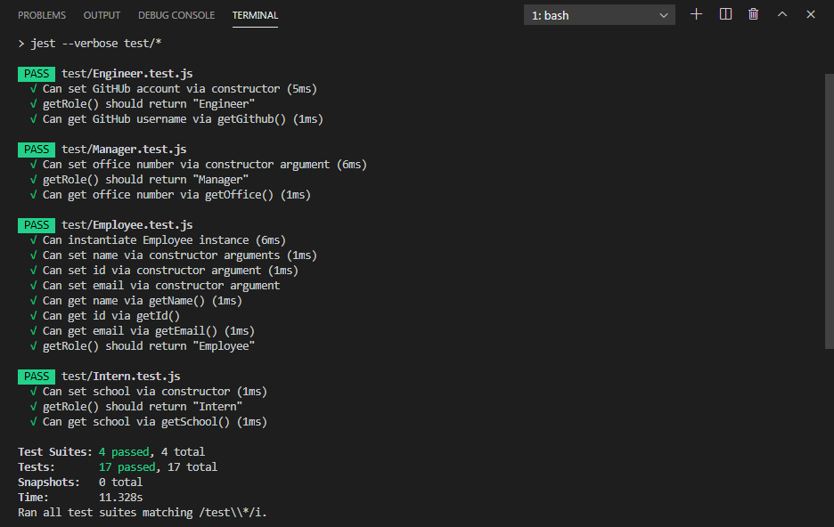

Walkthrough video link https://drive.google.com/file/d/1qao8jCBsQjsK3tkUvgGz07jr-DfGq_C1/view
<br>
Youtube https://www.youtube.com/watch?v=9b8An9X4pvQ

# Team-Profile-Generator
  

## Table of Contents
  * [Description](#Description)
  * [Installation](#Installation)
  * [Usage](#Usage)
  * [Testing](#Testing)
  * [License](#License)


## Description  
The application dynamically generates a team profile summary, that asks employees certain questions, to create a page with cards containing that info and live links to employees GitHub pages as well. The app works as a template, that user will fill up by answering questions inside the command line in Node.
<br><br> 

## Installation
To run this application, the user will need to install `Inquirer.js`, which is a command line interface package for Node.js that initiates the process of asking questions, providing error feedback, validating answers and other query-based tasks.
Also the user is going to need `package.json` that will hold various metadata relevant to the project. This file is used to give information to npm that allows it to identify the project as well as how to handle the project's dependencies.
To install all dependancies use command: 
```
npm i
``` 
<br>

## Usage 

The user can invoke this application by opening the app.js file in the Node command line by typing `node app.js`. Then the user(manager) will be prompted with a series of questions about his id, name and some personal information inside the command line. After the questions have been answered, the manager will get an option to add more employees(engineers or interns) or finish adding. If the last option has been chosen, the manager will get a confirmation message `"Team summary has been generated"`. The file will be located in the folder `Output` and will be named `Team.html`.<br>
The profile page can be opened in a browser window and has been styled accordingly to a chosen theme, that can be changed by editing the file `style.css` located in the same folder. 
The files containing classes with the info about the employees (name, email, id, school, GitHub name etc), that needs to be collected, are located in the folder `lib` in the root directory, can be easily modified, if needed. 
<br><br>

## Testing
The app was tested using framework Jest, that simply checks the instance properties after classes were initialized.<br> 
Here's a screenshot of the testing log: <br><br>


<br>

## License
Copyright © 2020 Anastasia Ivashchenko

    Permission is hereby granted, free of charge, to any person obtaining a copy of this software and associated documentation files (the "Software"), to deal in the Software without restriction, including without limitation the rights to use, copy, modify, merge, publish, distribute, sublicense, and/or sell copies of the Software, and to permit persons to whom the Software is furnished to do so, subject to the following conditions:
    
    The above copyright notice and this permission notice shall be included in all copies or substantial portions of the Software.
    
    THE SOFTWARE IS PROVIDED "AS IS", WITHOUT WARRANTY OF ANY KIND, EXPRESS OR IMPLIED, INCLUDING BUT NOT LIMITED TO THE WARRANTIES OF MERCHANTABILITY, FITNESS FOR A PARTICULAR PURPOSE AND NONINFRINGEMENT. IN NO EVENT SHALL THE AUTHORS OR COPYRIGHT HOLDERS BE LIABLE FOR ANY CLAIM, DAMAGES OR OTHER LIABILITY, WHETHER IN AN ACTION OF CONTRACT, TORT OR OTHERWISE, ARISING FROM, OUT OF OR IN CONNECTION WITH THE SOFTWARE OR THE USE OR OTHER DEALINGS IN THE SOFTWARE.
    
    
